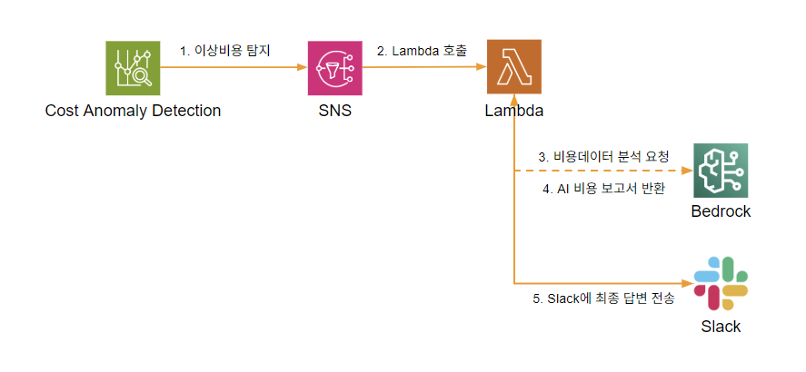
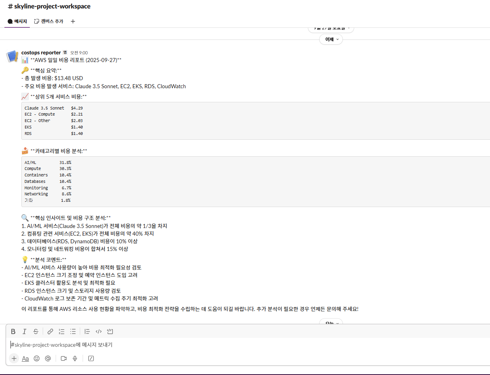

# 📈 GenAI 기반 AWS 비용 데일리 리포트 챗봇

매일 아침, 지정된 Slack 채널에 전날의 AWS 비용을 분석하여 브리핑해 주거나, 사용자가 직접 비용 관련 질문을 하면 답변해주는 지능형 데일리 리포트 챗봇 프로젝트입니다.

---

## 🎯 프로젝트 배경
매일 아침 전날의 클라우드 비용을 확인하고 특이사항을 정리하여 팀에 공유하는 업무는 중요하지만 반복적입니다. 또한, 갑작스러운 비용 질문에 대응하기 위해 담당자는 다른 업무를 중단하고 Cost Explorer를 분석해야 했습니다.

본 프로젝트는 이러한 반복적인 비용 브리핑과 분석 업무를 **GenAI Agent에게 위임**하여, 팀 전체가 **매일 아침 커피 한 잔과 함께 쉽고 빠르게 비용 현황을 파악**하고, **비용에 대한 궁금증을 즉시 해소**할 수 있도록 돕기 위해 시작되었습니다.

---

## 🏗️ 솔루션 아키텍처
본 솔루션은 **Amazon EventBridge**의 스케줄링 기능으로 매일 아침 자동으로 리포트를 생성하고, 사용자의 요청에 응답하기 위해 **API Gateway**를 함께 사용합니다. 모든 인프라는 Terraform(IaC)으로 관리됩니다.

**핵심 흐름:**
1.  **자동 리포팅:** EventBridge가 정해진 시간에 Worker Lambda를 트리거하여 Bedrock Agent가 전날 비용을 분석하고 Slack 채널에 브리핑합니다.

---

## ✨ 핵심 기능 및 데모
- **자동 데일리 브리핑:** 매일 오전 9시, 전날 비용 총액, 서비스별 Top 3, 전주 대비 증감률 등을 요약하여 Slack 채널에 자동 포스팅합니다.

---

## 🛠️ 기술 스택
- **Cloud:** AWS (Lambda, API Gateway, S3, Athena, Glue, EventBridge, Secrets Manager)
- **GenAI:** Amazon Bedrock (Agent, Claude v3.5)
- **IaC:** Terraform
- **Language:** Python 3.13
- **Collaboration:** Slack

---

## 💡 배운 점 및 회고
이번 프로젝트를 통해 **'문제를 해결하는 자동화'를 넘어 '정보를 먼저 제공하여 문제를 예방하는 자동화'**의 가치를 체감할 수 있었습니다.

단순히 사용자의 질문에 답하는 챗봇을 넘어, 매일 아침 AI가 먼저 팀원들에게 비용 현황을 브리핑하는 파이프라인을 구축하며, 기술이 어떻게 팀의 **'업무 리듬'**과 **'소통 문화'**를 긍정적으로 바꿀 수 있는지 깊이 고민할 수 있었습니다. '어제 비용 얼마 나왔지?'라며 각자 툴을 확인하던 시간을, 'AI 리포트를 보니 특이사항이 있네요'라며 다 같이 논의하는 시간으로 바꿀 수 있다는 점에서, 진정한 의미의 운영 효율화를 경험했습니다.

## 🚀 Next Step
현재는 비용 데이터에 한정된 리포트를 제공하지만, 이 구조를 확장하여 단순한 '비용 리포터'를 넘어 팀의 모든 상황을 브리핑하는 **'AI 스크럼 마스터'**로 발전시킬 수 있습니다.

성능 지표(APM) 통합: 전날의 CPU/Memory 사용량 Top 5 서비스나 가장 느렸던 API 엔드포인트, 에러 발생률 등을 비용과 함께 브리핑하여 성능과 비용의 상관관계를 한눈에 파악하게 합니다.

운영 이벤트 통합: 전날 있었던 주요 배포나 장애 이벤트를 함께 요약하여, 비용 및 성능 변화의 컨텍스트를 제공합니다.

AI 기반 이상 징후 분석: 단순 요약을 넘어, AI가 스스로 "어제 자 S3 비용이 평소보다 30% 급증했습니다" 와 같이 통계적으로 의미 있는 특이사항을 찾아내 하이라이트해주는 기능을 추가합니다.

이를 통해 팀은 매일 아침, 전날의 비용, 성능, 운영 이벤트를 종합적으로 담은 **'AI 데일리 브리핑'**을 받으며 훨씬 더 데이터에 기반한 하루를 시작할 수 있을 것입니다.